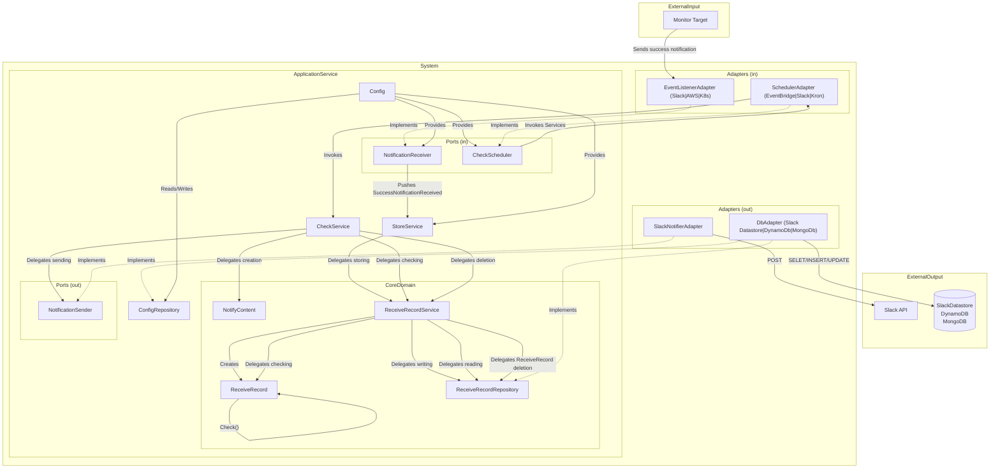

# success-notification-aggregator

> [!WARNING]
> This is a WIP project

A tool to consolidate success notifications into a single, reliable report.

Benefits:
- **Uncluttered Success Monitoring**: Aggregates multiple success notifications into a single one
- **Enhanced Reliability**: Reduces the risk of missing critical failure alert
- **Cost-Effective**: Minimizes maintenance overhead by utilizing Slack Platform

## Introduction

Managing multiple success notifications can be challenging and error-prone, especially when one goes missing.
success-notice-aggregator (SNA) is designed to solve this problem by consolidating expected notifications and ensuring none are missed.

## How It Works

1. **Configuration**:
   - Define expected success notifications using regex patterns
   - Specify URLs to check in case of missing notifications
   - Configure a schedule for regular checks
   - Provide necessary permissions for Slack integration
   - Specify channels for sending success messages or failure alerts

2. **Event-Driven Operations**:
   - **POST Event**: When a success notification is received, SNA converts it into a `ReceiveRecord` by assigning a unique ID. This record is then posted to the Slack Platform.
   - **Scheduled Event**: On a defined schedule, SNA checks the arrival of all expected notifications and sends alerts if any of them are missing.

3. **Identity Verification of Notification**:
   - SNA verifies the identity of success notifications by adding a hash value generated from the following:
     - Config file of the Slack Platform for the SNA
     - Registered name of the target batch process
     - Regex pattern of expected success notification for each target batch process
   - This identity verification ensures accurate monitoring by avoiding false-positive failure alerts, especially when multiple SNAs are monitoring the same batch process. Each `ReceiveRecord` created from a success notification ensures that the same notification can be correctly identified and verified during checks.

4. **Transformation and Storage**:
   - Upon receiving a success notification, the system processes it through several stages:
     - **Signature Verification**: Ensures the authenticity of the notification.
     - **Injection Protection**: Safeguards against malicious content.
     - **ID Assignment**: Assigns a unique identifier to create a `ReceiveRecord`.
     - **Storage**: Stores the `ReceiveRecord` in the configured repository.

5. **Regular Checks**:
   - The Scheduler triggers regular checks.
   - The system verifies the stored `ReceiveRecords` to ensure all expected notifications are present.
   - If any notification is missing, an alert is generated and sent via Slack.

## Security Considerations

- **Injection Protection**: Safeguards against malicious code injections from monitored processes.
- **Signed Notifications**: (Future Feature) Use HMAC signatures to verify the authenticity of incoming notifications.

## Example Flow

1. A success notification is sent from an external batch system to the `SuccessNotificationEndpoint`.
2. The notification goes through signature verification and injection protection.
3. An ID is assigned to the notification, converting it into a `ReceiveRecord`.
4. The `ReceiveRecord` is stored in the repository (Slack Datastore, DynamoDB, MongoDB).
5. The Scheduler initiates a check, and the system verifies the stored `ReceiveRecords`.
6. If a `ReceiveRecord` is missing, an alert is sent to the specified Slack channel.

## Architecture

