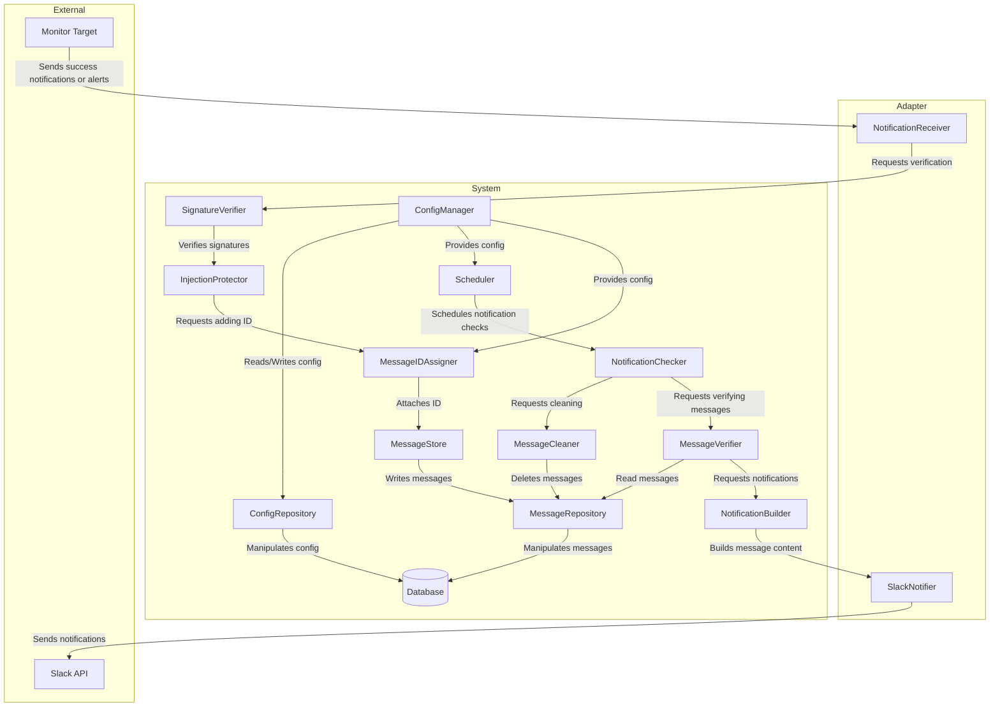

# success-notification-aggregator

> [!WARNING]
> This is a WIP project

A tool to consolidate success notifications into a single, reliable report.

Benefits:
- **Uncluttered Success Monitoring**: Aggregates multiple success notifications into a single one
- **Enhanced Reliability**: Reduces the risk of missing critical failure alert
- **Cost-Effective**: Minimizes maintenance overhead by utilizing Slack Platform

## Introduction

Managing multiple success notifications can be challenging and error-prone, especially when one goes missing.
success-notice-aggregator (SNA) is designed to solve this problem by consolidating expected notifications and ensuring none are missed.

## How It Works

1. **Configuration**:
   - Define expected success notification using regex patterns
   - Specify URLs to check in case of missing notifications
   - Configure a schedule for regular checks
   - Provide necessary permissions for Slack integration
   - Specify channels for sending success messages or failure alerts

2. **Event-Driven Operations**:
   - **POST Event**: When a success notification is received, SNA converts it into a form whose identity can be verified at check time and posts to the Slack Platform
   - **Scheduled Event**: On a defined schedule, SNA checks the arrival of all expected notifications and sends alerts if any of them are missing

3. **Identity Verification of Notification**:
   - SNA verifies the identity of success notifications by adding hash value generated from values below:
     - Config file of Slack Platform of the SNA
     - Registered name of the target batch process
     - Regex pattern of expected success notification of each target batch process
   - This identity verification is important because a lax verification would result in false-positive failure alerts in case of several SNAs monitor success notifications from a single batch process:
     - One SNA deleting the success notification, causing the other SNA to consider the success notification undelivered

## Security Considerations

- **Injection Protection**: Safeguards against malicious code injections from monitored processes
- **Signed Notifications**: (Future Feature) Use HMAC signatures to verify the authenticity of incoming notifications

## Architecture

## License

MIT &copy; [Akira Hayash](https://github.com/Rindrics)
